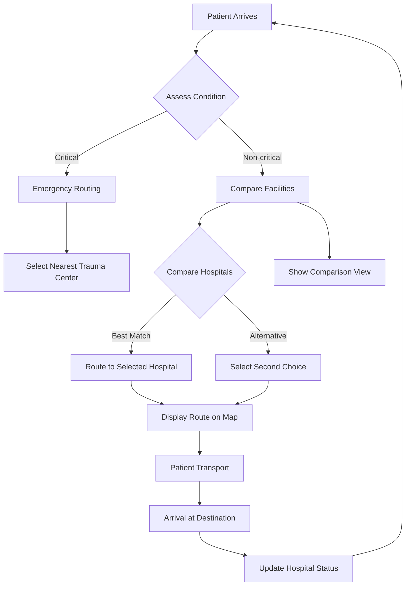
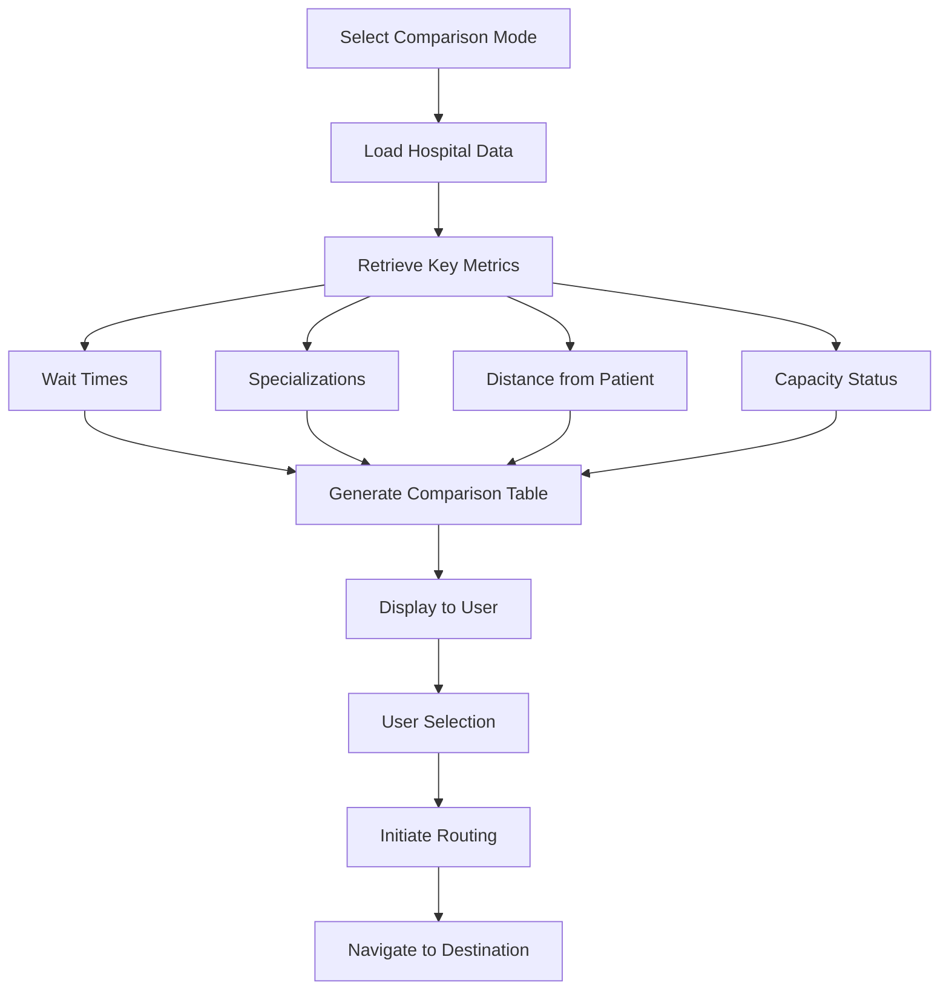
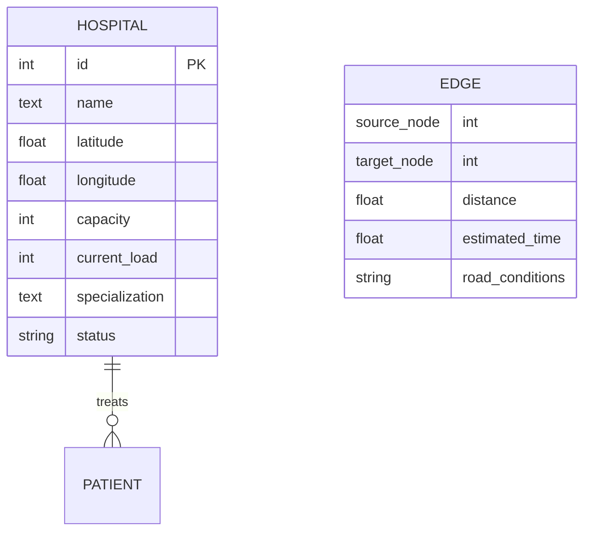

# CodeBlue-Nav

**CodeBlue-Nav** is a comprehensive emergency medical response navigation system designed to help first responders and medical teams quickly locate hospitals, manage patient routing, and coordinate emergency care resources.


## Table of Contents

1. [Overview](#overview)
2. [File Structure](#file-structure)
3. [Introduction](#introduction)
4. [Features](#features)
5. [Installation](#installation)
6. [Usage](#usage)
7. [Technology Stack](#technology-stack)
8. [Project Architecture](#project-architecture)
9. [Mermaid Flowcharts](#mermaid-flowcharts)
10. [API Endpoints](#api-endpoints)
11. [Contributing](#contributing)

---

## Overview

CodeBlue-Nav is an emergency response application that provides:
- Hospital location and navigation
- Real-time patient routing
- Emergency resource management
- Comparative analysis of medical facilities
- Interactive mapping of healthcare infrastructure

The system helps emergency medical services (EMS) make data-driven decisions about patient destination and routing.

---

## File Structure

```text
DAA-HACK/
├── .git/                    # Git repository metadata
├── hospital_graph.db        # SQLite database with hospital network data
├── run_and_test.py          # Main execution and testing script
├── seed_graph.py            # Database seeding script
├── start_servers.py         # Server startup configuration
├── verify_nopath.py         # Path verification utility
├── test_algos.py            # Algorithm testing scripts
├── test_algos2.py           # Secondary algorithm tests
├── test_api.py              # API integration tests
├── test_api2.py             # Extended API tests
├── test_milestone5.py       # Milestone 5 validation
│
├── frontend/                # React + Tailwind frontend application
│   ├── package.json         # Frontend dependencies
│   ├── vite.config.js       # Vite build configuration
│   ├── tailwind.config.js   # Tailwind CSS configuration
│   ├── postcss.config.cjs  # PostCSS configuration
│   ├── index.css           # Global CSS styles
│   ├── main.jsx            # React application entry point
│   └── src/
│       ├── App.jsx          # Main application component
│       ├── index.css        # Component-level styles
│       ├── components/
│       │   ├── RouteLayer.jsx    # Routing layer component
│       │   ├── QueuePanel.jsx    # Patient queue management
│       │   ├── HospitalMap.jsx   # Interactive hospital map
│       │   ├── EmergencyModal.jsx # Emergency patient modal
│       │   ├── CompareToggle.jsx # Facility comparison toggle
│       │   └── AgentLog.jsx      # System log display
│       └── ...
│
└── README.md               # This documentation file
```

---

## Introduction

CodeBlue-Nav addresses the critical need for efficient emergency medical routing and hospital selection. When every second counts, our system provides:

- **Quick hospital identification** - Locate the nearest appropriate facility
- **Resource allocation** - Understand available capacity and specializations
- **Route optimization** - Calculate optimal paths considering traffic and distance
- **Comparative analysis** - Evaluate multiple facilities simultaneously

The application is built as a full-stack solution with a React frontend connecting to Python-based backend services that manage a hospital network graph database.

---

## Features

### Core Functionality

| Feature | Description |
|---------|-------------|
| **Hospital Map** | Interactive visualization of the hospital network with locations and capacities |
| **Patient Routing** | Automatic pathfinding to the best receiving facility |
| **Facility Comparison** | Side-by-side comparison of hospitals based on key metrics |
| **Queue Management** | Track patient waiting times and priority levels |
| **Emergency Modal** | Quick-response interface for critical situations |
| **Route Layer** | Visual representation of patient pathways |

### Data Management

- **SQLite Database** (`hospital_graph.db`) - Stores hospital nodes, edges, and metadata
- **Graph Algorithms** - Shortest path, minimum spanning tree, connectivity analysis
- **Dynamic Updates** - Real-time capacity and status changes

---

## Installation

### Prerequisites

- Node.js (v14 or higher)
- Python 3.8 or higher
- npm or yarn

### Frontend Setup

```bash
# Navigate to frontend directory
cd DAA-HACK/frontend

# Install dependencies
npm install

# Start development server
npm run dev
```

The frontend will be available at `http://localhost:5173` (or `http://localhost:3000` depending on Vite config).

### Backend Setup

```bash
# Navigate to root directory
cd DAA-HACK

# Ensure Python dependencies are available
pip install -r requirements.txt  # if present, otherwise install manually

# Start the Python server
python start_servers.py
```

### Database Initialization

The application uses a SQLite database. To seed the database with initial data:

```bash
python seed_graph.py
```

This will create and populate `hospital_graph.db` with the hospital network graph.

### Verification

```bash
# Verify the network paths
python verify_nopath.py
```

---

## Usage

### Starting the Application

1. **Start the backend server:**
   ```bash
   python start_servers.py
   ```

2. **Start the frontend development server:**
   ```bash
   cd frontend
   npm run dev
   ```

3. **Access the application:**
   Open your browser at `http://localhost:5173`

### Main Features

#### Hospital Map
- View all hospitals in the network
- See capacity indicators (color-coded)
- Click on markers for detailed information

#### Patient Routing
- Input patient location and severity level
- System suggests optimal hospital destination
- Visual route display on map

#### Comparison Mode
- Toggle between facilities
- Compare wait times, specializations, and distances
- Make informed routing decisions

#### Emergency Mode
- Quick access to nearest appropriate facilities
- Bypass comparison for critical situations
- Priority routing to highest-capacity centers

---

## Technology Stack

### Frontend

| Technology | Purpose |
|------------|---------|
| **React** | User interface framework |
| **Vite** | Build tool and dev server |
| **Tailwind CSS** | Utility-first styling |
| **PostCSS** | CSS processing pipeline |
| **React Router** | Navigation and routing |

### Backend

| Technology | Purpose |
|------------|---------|
| **Python 3** | Server-side logic |
| **SQLite** | Local database storage |
| **NetworkX** (likely) | Graph algorithm operations |
| **Flask/FastAPI** (likely) | API framework |

### Utilities

- **Mermaid** - Diagram generation for documentation
- **Git** - Version control

---

## Project Architecture

### High-Level Design

```
┌─────────────────────────────────────────────────────────┐
│                    CODEBLUE-NAV                         │
│                                                         │
│           ┌──────────────┐      ┌─────────────────┐     │
│           │  Frontend    │◄────►│   Backend API   │     │
│           │  (React)     │      │   (Python)      │     │
│           └──────────────┘      └─────────────────┘     │
│                ▲                  ▲                   │
│                │                  │                   │
│      ┌─────────┴─────────┐  ┌─────┴─────────────┐   │
│      │  hospital_graph.db│  │  Python Scripts   │   │
│      │  (SQLite Graph)   │  │  (seed, verify)   │   │
│      └───────────────────┘  └───────────────────┘   │
│                                                         │
└─────────────────────────────────────────────────────────┘
```

### Data Flow

1. **User Interaction** - Frontend captures patient location/needs
2. **API Request** - React app sends query to Python backend
3. **Graph Processing** - Backend runs pathfinding algorithms on `hospital_graph.db`
4. **Response** - Optimal hospital routing returned as JSON
5. **Visualization** - Frontend displays map, routes, and comparisons

### Key Algorithms

- **Shortest Path** (Dijkstra/A*) - Minimum distance routing
- **Capacity-aware routing** - Factor in current hospital occupancy
- **Connectivity analysis** - Verify path existence between nodes

---

## Mermaid Flowcharts

### Patient Routing Flow



### Hospital Comparison Flow



### Database Schema



---

## API Endpoints

### Core Endpoints

| Method | Endpoint | Description |
|--------|----------|-------------|
| `GET` | `/api/hospitals` | Retrieve all hospitals in the network |
| `GET` | `/api/hospitals/:id` | Get detailed information for a specific hospital |
| `POST` | `/api/route` | Calculate optimal route between locations |
| `GET` | `/api/compare` | Compare multiple hospitals |
| `GET` | `/api/status` | System status and database health |

### Request/Response Examples

**Get All Hospitals:**
```http
GET /api/hospitals
```

```json
{
  "hospitals": [
    {
      "id": 1,
      "name": "General Hospital",
      "latitude": 40.7128,
      "longitude": -74.0060,
      "capacity": 200,
      "current_load": 150,
      "specialization": "Emergency",
      "status": "open"
    }
  ]
}
```

**Calculate Route:**
```http
POST /api/route
Content-Type: application/json

{
  "start": {"lat": 40.71, "lng": -74.01},
  "end": {"lat": 40.72, "lng": -74.02},
  "patient_severity": "medium"
}
```

```json
{
  "route": [
    {"lat": 40.71, "lng": -74.01},
    {"lat": 40.715, "lng": -74.015},
    {"lat": 40.72, "lng": -74.02}
  ],
  "total_distance": 5.2,
  "estimated_time": 12,
  "recommended_hospital": {"id": 1, "name": "General Hospital"}
}
```

---

## Contributing

### Development Setup

1. Fork the repository
2. Create a feature branch: `git checkout -b feature/amazing-feature`
3. Commit your changes: `git commit -m 'Add some amazing feature'`
4. Push to the branch: `git push origin feature/amazing-feature`
5. Open a Pull Request

### Code Guidelines

- Follow the existing code style
- Add appropriate comments and documentation
- Ensure all new features have corresponding tests
- Update README.md with any new functionality

### Running Tests

```bash
# Frontend tests
cd frontend
npm test

# Backend tests
cd DAA-HACK
python -m pytest test_*.py
```

---

## License

This project is licensed under the MIT License - see the LICENSE file for details.

---

## Contact

For questions and support, please open an issue in the GitHub repository or contact the development team.

---

*Generated with ❤️ for emergency medical response optimization*